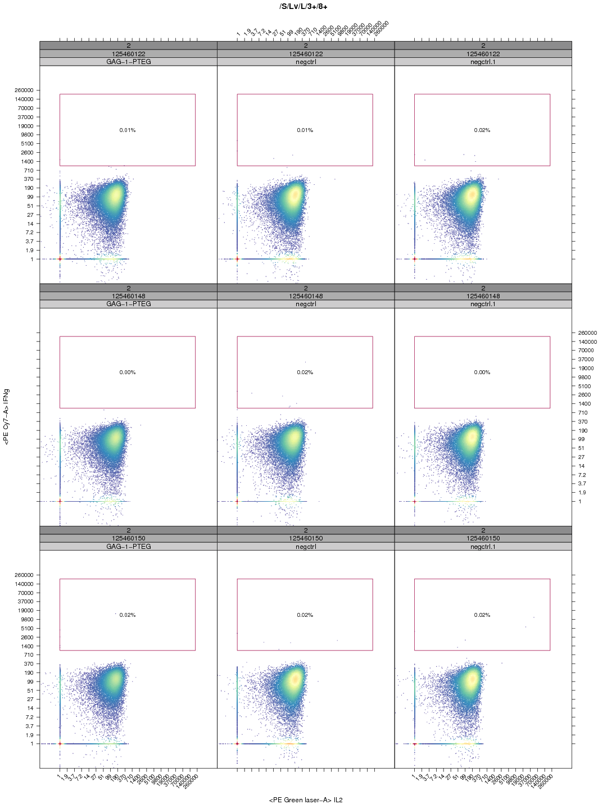
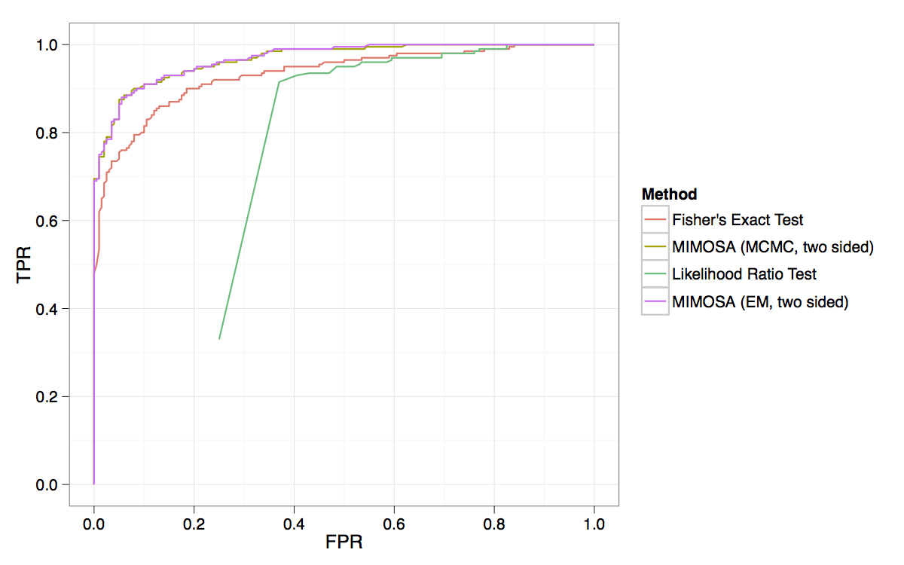
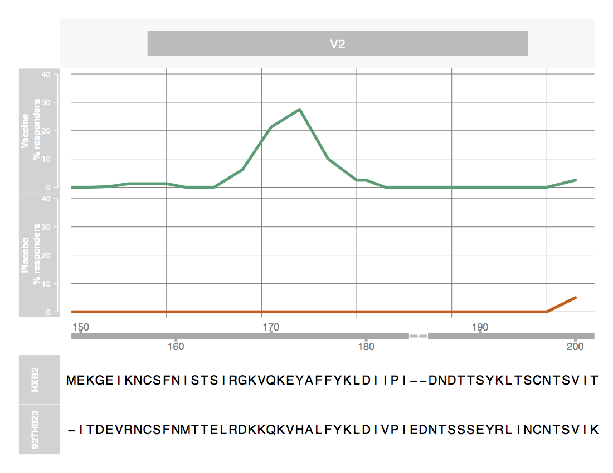
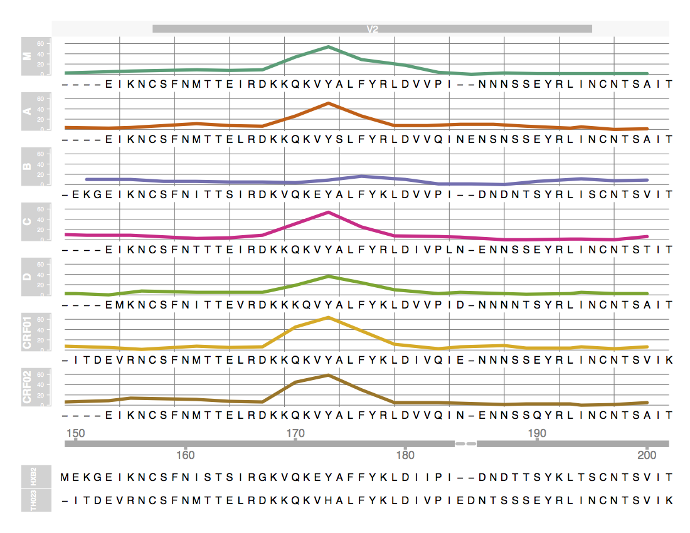
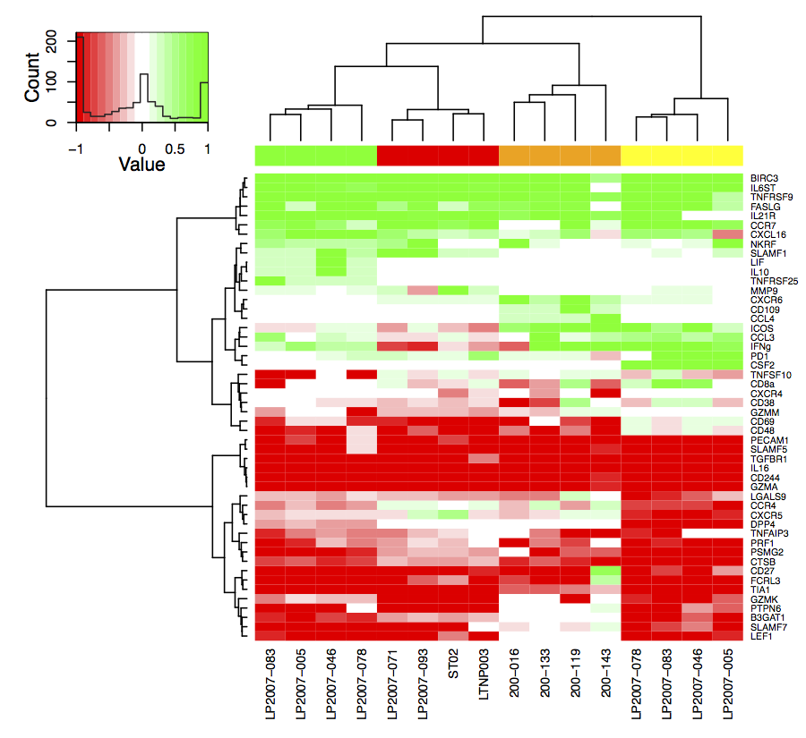
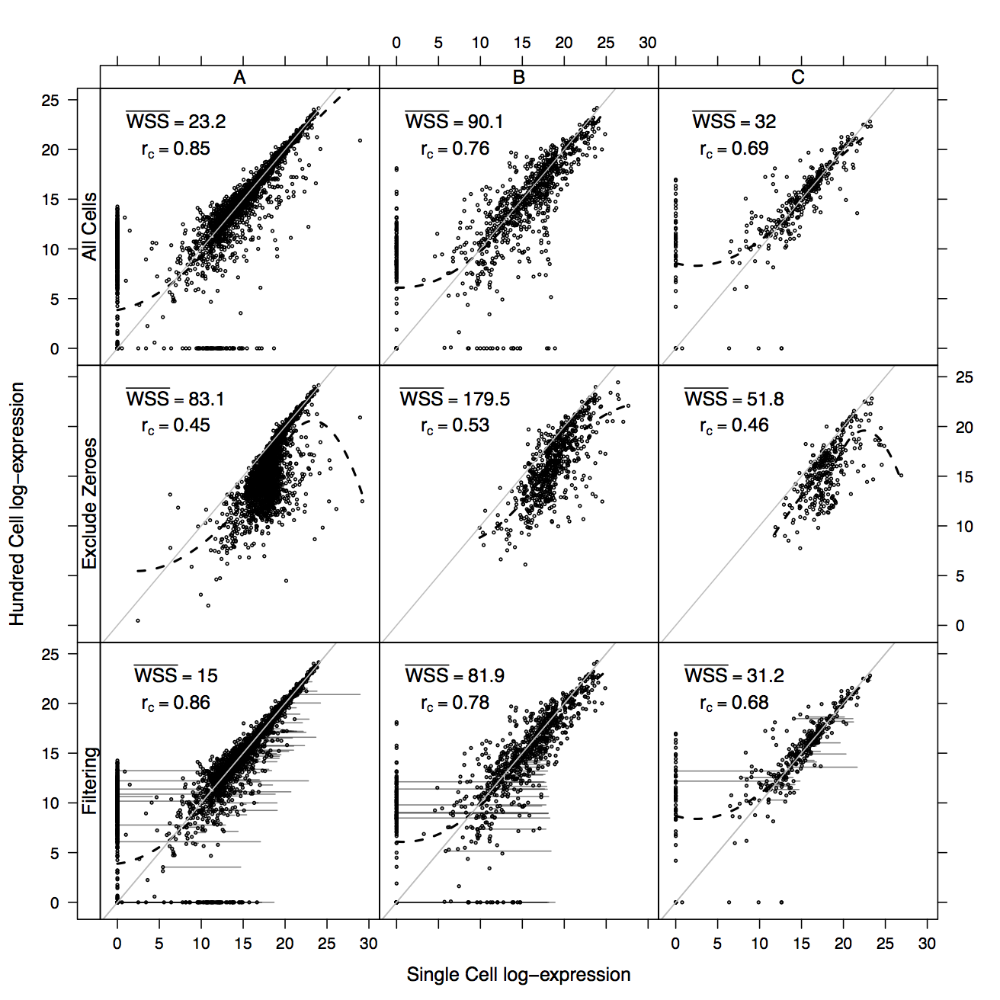
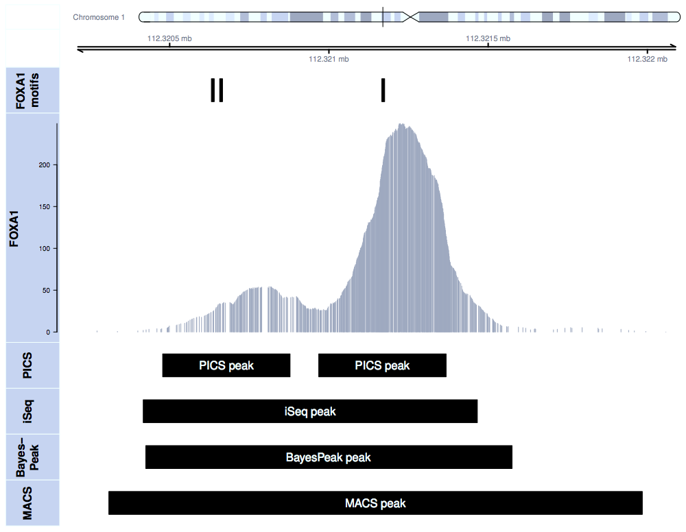
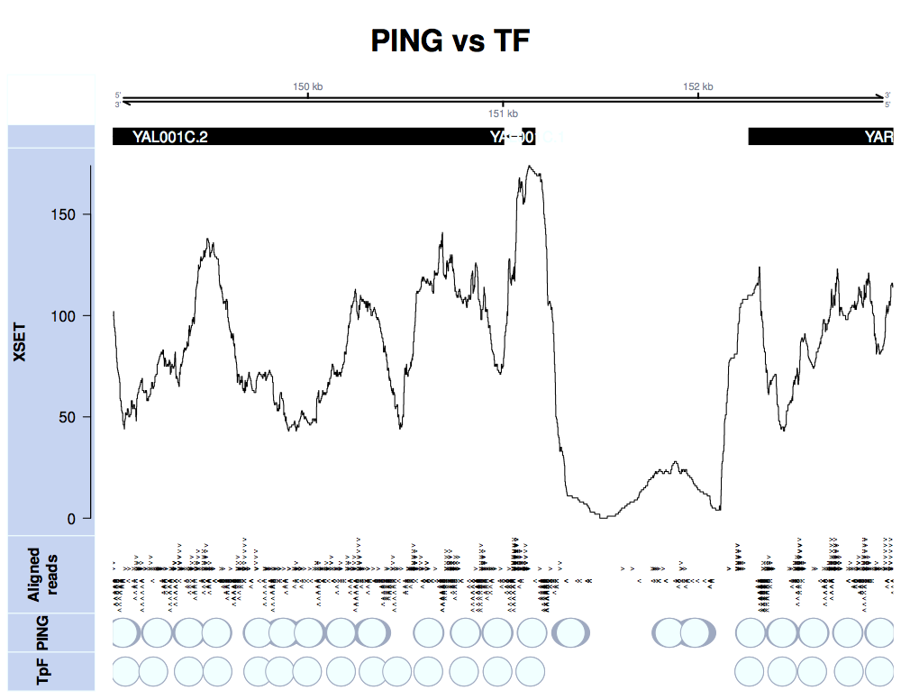
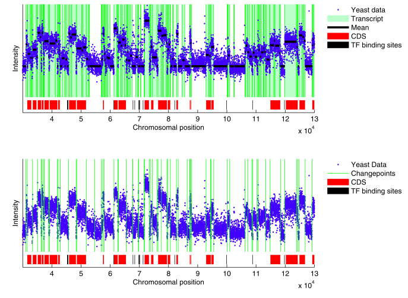
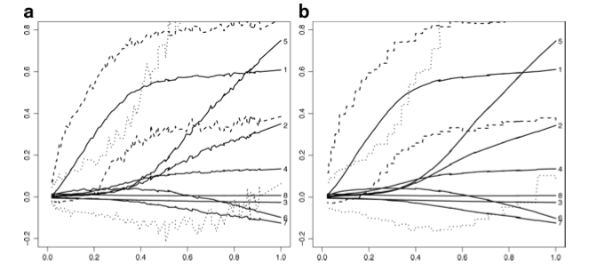

> ## What do we do?
> Our main research interest is the development of cutting edge statistical methods and software tools for the analysis of high throughput biological data with an emphasis on immunology and vaccine research. Please use the tab navigation below to learn more about specific active research projects in the lab.

## {.tabset}

### Cytometry

We do research on new statistical methods for analyzing flow cytometry data, including methods for determining vaccine positivity, automated and semi-automated gating and data analysis pipelines, as well as quality assurance, quality control, and visualization.

#### FlowViz Visualization With Conditioning on Study Variables

We have extended [flowViz](https://github.com/RGLab/flowViz) to allow for visualization of large data sets of manually gated flow data with associated study metadata using the standard R formula interface. Data exploration and quality control are greatly simplified with the new API.

#### Comparison of MIMOSA against other methods for vaccine positivity calls

We are developing statistical methods for downstream analysis of flow cytometry assay data. MIMOSA is a new method for identifying vaccine responders from ICS (intracellular cytokine staining) data. The figure shows a comparison of the sensitivity and specificity of MIMOSA compared to other methods for determining vaccine response.

### Peptide microarrays

Our group researches advanced statistical modeling techniques to improve the power to detect antibody epitopes using peptide microarray experiments. We aim to develop flexible, robust methodology that shares relevant information between subjects while accommodating aspects of experiments that are unique to immunological applications. We are also developing a unified software environment to streamline data analysis from preprocessing up through detection and visualization. Our methodology is currently being applied to many vaccine trials including human and non-human primate studies.

The two figures below show an application of our analysis and visualization pipeline applied to the RV144 pilot microarray data published in [AIDS Research and Human Retroviruses](http://online.liebertpub.com/doi/full/10.1089/aid.2012.0103).

#### RV144 V2 loop aggregate response

We can observe a strong V2 response in the vaccine group and no response in the placebo group.

#### RV144 V2 loop subtype specific responses

The strongest response is observed in CRF01 whereas B is the smallest.

### Single-cell expression

Although cells sorted using well-established surface markers may appear homogeneous, mRNA expression of other genes within these cells can be heterogeneous and could further characterize cell poly-functionality. New technologies based on microfluidic arrays combined with multiplexed polymerase chain reactions (PCR) can now be used to perform thousands of PCRs in a single device, enabling simultaneous, high-throughput gene expression measurements at the single-cell level across hundreds of cells and genes. While classic gene expression microarrays sum the expression from many individual cells, the intrinsic stochastic nature of biochemical processes results in relatively large cell-to-cell gene expression variability.This heterogeneity may carry important information, thus single cell expression data should not be analyzed in the same fashion as cell-population level data. We are currently developing statistical methods and tools for the analysis of single cell gene expression data (e.g. [MIMOSA](http://arxiv.org/abs/1208.5809), [SingleCellAssay](http://arxiv.org/abs/1210.1226)).

#### Single-Cell Gene Expression and Positivity

Subject-specific differences as well as stimulation-specific common patterns in single-cell gene expression are observed between differentially stimulated, tetramer-sorted cell subpopulations. The data was analyzed using our new MIMOSA (Mixture Models for Single-Cell Assays) tool.

#### Concordance of Single-Cell and Hundred-Cell Gene Expression Experiments

The concordance between single-cell gene expression experiments and the average per-cell expression from 100-cell gene expression experiments is shown for three different data sets (columns) when unexpressed genes are treated as missing observations (second row) or as exact zeros (top row). Filtering of outlier values is applied (last row) improving concordance between the experiments. Treating unexpressed genes as zeros rather than missing observations improves the concordance, indicating that these genes are truly not expressed rather than undetectable through this technology.

### Immunology/Vaccinology

We collaborate with bench scientists and clinicians throughout multiple networks including the [HIV Vaccine Trials Network](http://www.hvtn.org/), the [Microbicide Trials Network](http://www.mtnstopshiv.org/), the [Immune Tolerance Network](http://www.immunetolerance.org/) and the [Human Immunology Project Consortium](http://www.immuneprofiling.org/). In particular we develop and implement tools and methods for data processing and analysis of immunological assays used for measuring vaccine immunogenicity (e.g., ICS, multiplex bead arrays), increasingly involving higher dimensional assays (e.g., mass cytometry for assessing high-dimensional functions of single cells), and to provide statistical validation and standardization of assays. Using these tools, our aim is to	use system approaches to predict how the immune system will respond to a particular infection of vaccination.

Here are some of the applications we are currently working on:

#### Epitope mapping

In collaboration with the [HVTN](http://www.hvtn.org/) we are testing new methods for positivity calls ([MIMOSA](http://arxiv.org/abs/1208.5809)) on other assays, including epitope mapping and EliSpot.

#### Immune correlates

We are currently working on identifying immune response biomarkers that correlate with vaccine efficacy (e.g. protection/infection) for the RV144 and RTS'S trials.

#### Poly-functionality

In collaboration with researchers from the [HVTN](http://www.hvtn.org/), we are working on utilizing high dimensional technologies that measure multiple functions (e.g. genes, cytokines) from individual cells to characterize cell poly-functionality in response to vaccination. The working hypothesis is that cells producing multiple functions or certain combinations of functions are more beneficial to a clinical outcome such as control or prevention of infection.

### Epigenomics

For the past decade, microarrays have been the platform of choice for various high-throughput biological studies. In fact, our group has significantly contributed to the development of statistical methods for microarray data. Recent improvements in the efficiency, quality, and cost of genome-wide sequencing are prompting biologists to rapidly abandon microarrays in favor of so-called next-generation sequencers. Next-generation sequencing technologies, capable of producing tens of millions of sequence reads during each instrument run, have already been applied for studying genome-wide transcription levels (RNA-Seq), transcription factor binding sites and nucleosome positioning (ChIP-Seq), and DNA methylation status. While sequencing-based studies have been promoted as overcoming longstanding limitations of microarray-based studies, these new biotechnologies raise similar as well as novel statistical and computational challenges. These sequencing technologies generate massive data sets (much larger than with microarrays), and there is a pressing need for statistical and computational tools to make sense of these data. To this end, our group has developed several methods for the analysis of ChIP-Seq and MNase-Seq data. The Figures below illustrate our analysis pipeline using [PICS](http://www.bioconductor.org/packages/devel/bioc/html/PICS.html), [rGADEM](http://www.bioconductor.org/packages/devel/bioc/html/rGADEM.html), [MotIV](http://www.bioconductor.org/packages/devel/bioc/html/MotIV.html) and [PING](http://www.bioconductor.org/packages/devel/bioc/html/PING.html).

#### PICS increases spatial resolution of binding event detection

Transcription factor binding sites identified by PICS, iSeq, BayesPeak and MACS. PICS identifies two binding events in this region while other three methods identify these two events as one broad enriched region.

#### PING identifies weakly positioned nucleosomes.

Expected Nucleosome positioning in Chr1 for 149000-153000 genomic region using PING and TpF. PING can identify nucleosome positioning with weak signal compared to TpF.

### Statistical computing

Data resulting from novel high throughput technologies have lead to novel statistical problems and challenges. In addition, data are being accumulated more quickly than they can actually be analyzed. As a consequence, it is essential that analytical tools and statistical methods evolve in parallel with the assay technologies and datasets. Our group has developed many statistical methods for the analysis of high dimensional high throughput datasets including mixture models, sequential Monte Carlo, Markov chain Monte Carlo, and change point models (See examples below). We also implement state-of-the-art software for the analysis of large datasets using parallel programming (OpenMP, GPU) and efficient data formats (NetCDF, HDF5).

#### Change-point modeling of DNA tiling arrays

Segmentation results for part of chromosome 1 for the yeast genome expression data using our SMC algorithm and least-squares change point model estimation. For the top graph, the MAP estimate is displayed with transcript segments (green background), non-transcript segments (white background) and black segments for the segment intensity levels. For both top and bottom graphs, segments boundaries are represented with green vertical lines. Transcript annotations are shown below with red rectangles representing coding sequences and black segments representing TF binding sites. More precise estimation of known transcript boundaries can be obtained with [our approach](http://www.springerlink.com/content/3880054343602gw8/).

#### Lasso-type regularization path plots SMC vs. MCMC

Plots using MCMC and SMC for fixed computational time of 5 min. The MCMC plot is a lot more noisy than the SMC version ([our approach](http://www.springerlink.com/content/3880054343602gw8/)).